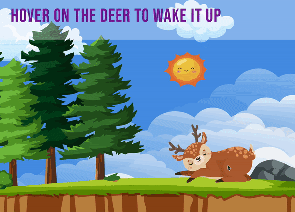

# cta-sprite-roll-over

## Description

* A single webpage showing one CTA rollover via a single sprite image. 
* It is used a SVG with PNG fallback.
* What is CSS sprite rollover? =>  [Click here to find out](https://css-tricks.com/snippets/css/basic-link-rollover-as-css-sprite/#:~:text=The%20rollover%20shifts%20the%20position,different%20area%20of%20the%20graphic.)

## Demo

